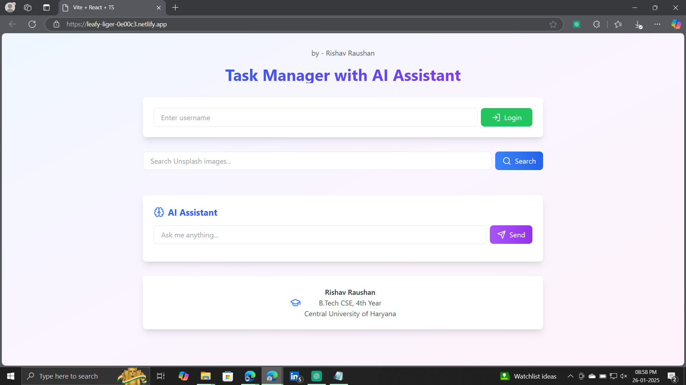
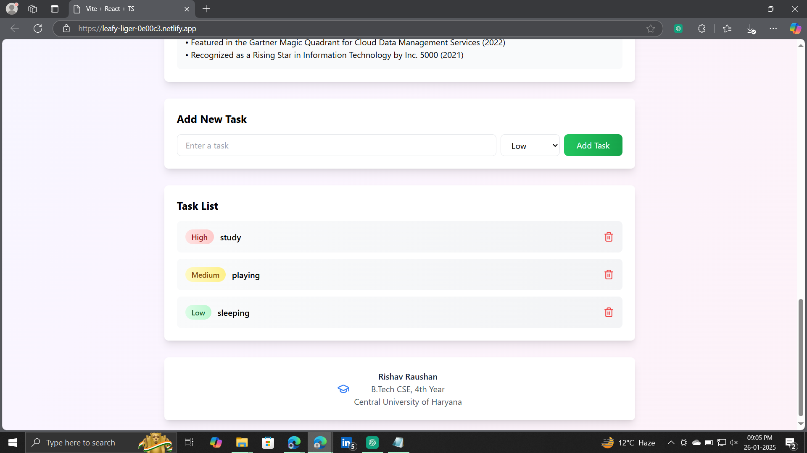
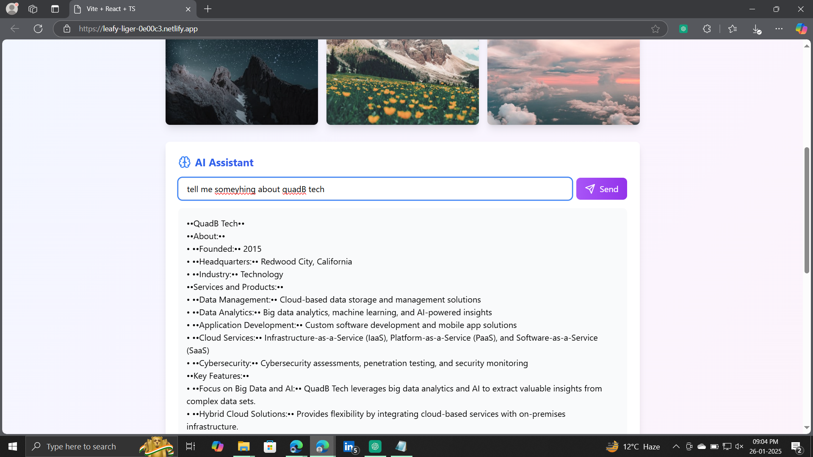
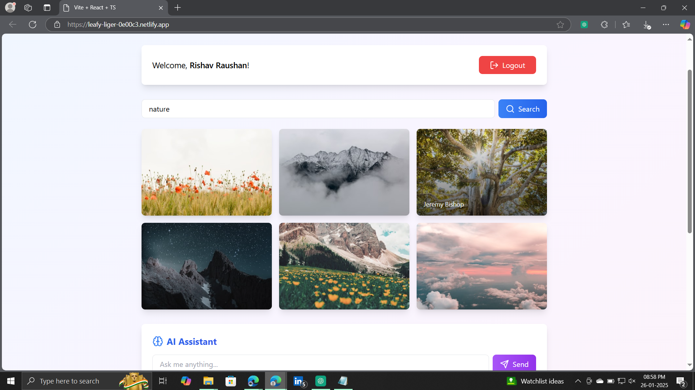

# React To-Do App with AI Assistant and Image Search

## Overview
This is a feature-rich React application that integrates a task management system, an AI assistant (using the Gemini AI API), and an image search feature (using the Unsplash API). The application is fully responsive and includes user authentication to protect the To-Do list.

#Screenshot :
  
   

## Features

### Task Management
  #Screenshot :
  
   

- Add, edit, delete tasks.
- Prioritize tasks (High, Medium, Low).
- Automatic sorting of tasks by priority.
- Protected behind user authentication.

### AI Assistant
 #Screenshot :
  
   


- Chat with an AI assistant powered by Gemini AI.
- Enhanced formatting of responses for better readability (e.g., points displayed in a list).
- Real-time interaction with a clean and intuitive interface.

### Image Search
  #Screenshot :
  
   

- Search for images using the Unsplash API.
- Display images in a responsive, grid-based gallery.
- Hover effects and image attribution.

### Authentication
- Simulated login/logout functionality using Redux.
- Protect To-Do list features behind authentication.

### Enhanced UI/UX
- Light and colorful theme with gradient backgrounds.
- Smooth hover transitions and consistent shadow effects.
- Fully responsive for mobile, tablet, and desktop devices.

## Installation

### Prerequisites
- Node.js (Download from [Node.js](https://nodejs.org))
- npm or yarn

### Steps
1. Clone the repository:
   ```bash
   git clone https://github.com/rishav-raushan/AI_Assistance_and_AI_image_searcher_with_TODO
   cd react-todo-app
   ```
2. Install dependencies:
   ```bash
   npm install
   ```
3. Set up environment variables:
   - Create a `.env` file in the project root.
   - Add the following keys:
     ```env
     REACT_APP_UNSPLASH_ACCESS_KEY=get your key
     REACT_APP_GEMINI_API_KEY=get your key
     ```
4. Start the development server:
   ```bash
   npm start
   ```

## Usage

### Authentication
1. Enter a username to log in.
2. Once logged in, access the To-Do list features.
3. Click "Logout" to clear the session.

### Task Management
1. Add a task by entering the task description and selecting a priority.
2. Tasks are sorted automatically by priority.
3. Delete tasks using the "Delete" button.

### AI Assistant
1. Type a query in the AI chatbox.
2. Receive responses with proper formatting and orientation.

### Image Search
1. Enter a search term in the image search bar.
2. View the results in a responsive gallery layout.

## Architecture

### State Management
The application uses Redux for managing global state:

```plaintext
Redux Store
├── User State
│   ├── username
│   └── isAuthenticated
├── Tasks State
│   └── Array of tasks with priority
├── AI Response State
├── Images State
└── Loading State
```

### Component Structure
```plaintext
App
├── Auth
├── SearchBar
├── ImageGallery
├── AIAssistant
├── TaskInput
└── TaskList
```

### Data Flow
1. Actions dispatch state changes.
2. Reducers handle state updates.
3. Components receive state via selectors.
4. Async operations (e.g., API calls) handled by Redux Thunk.

### Authentication Flow
1. User enters a username to log in.
2. Redux state updates with `isAuthenticated` status.
3. Protected components render based on authentication state.
4. Logout clears user state.

### Task Management Flow
1. Tasks are stored in Redux.
2. Tasks are automatically sorted by priority.
3. CRUD operations are managed through Redux actions.
4. Task list is accessible only to authenticated users.

## Deployment
The application is deployed on Netlify:
- **URL:** [Deployed Application](https://leafy-liger-0e00c3.netlify.app/)

## License
This project is open-source and available under the MIT License.

## Contribution
Contributions are welcome! Please fork the repository and create a pull request.

## Contact
For any queries or suggestions, feel free to contact the maintainer at [rishavraushan1804@gmail.com].

